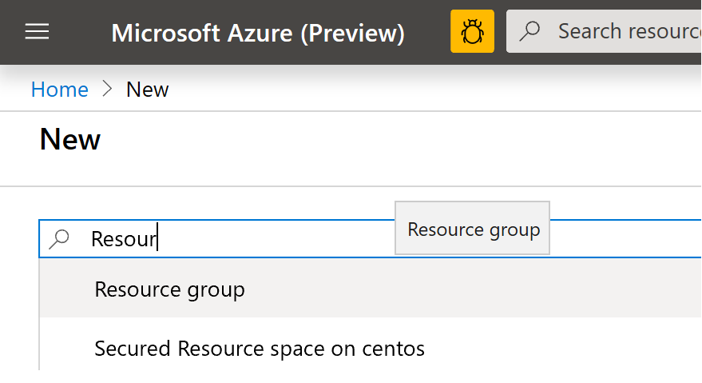
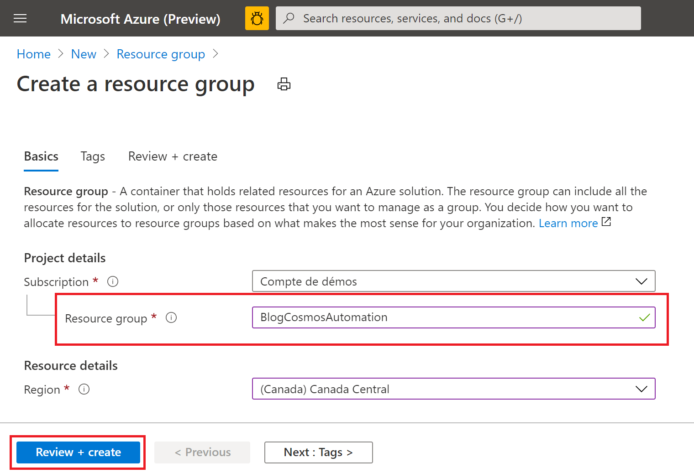
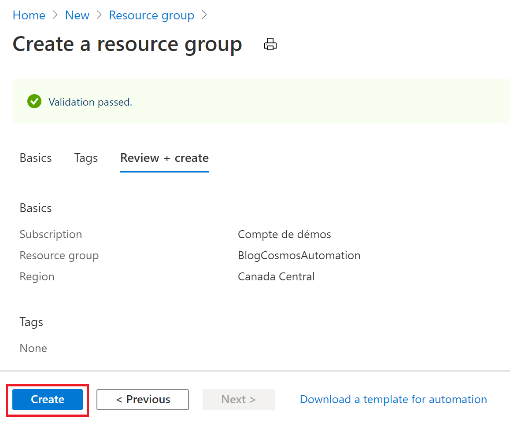

# Azure Cosmos DB : Pilotez les RU avec Azure Automation

Dans le scénario suivant, nous avons besoin d'ingérer et traiter une grande quantité d'information durant une période précise de la journée.
Etant donné que ce traitement se fait de manière récurrence et prédictible, il est donc aisé de planifier le changement de RU avec un service comme Azure automation.

Nous allons voir en détail comment mettre en place une solution avec Azure Automation pour effectuer ces changements de RU en fonction de nos besoins

## Prérequis

- [Un abonnement Azure](https://azure.microsoft.com/fr-fr/free/)

# Création des services Azure
## Création d'un groupe de ressources
Nous allons commencer par créer un groupe de ressources afin d'héberger les différents services de notre solution.

Depuis le portail [Azure](https://portal.azure.com), cliquez sur "**Create a resource**"

 Puis, recherchez "**Resource group**"

 

Cliquez sur le bouton "**Create**"

Donnez un nom au groupe de reessources puis cliquez sur le bouton "**Review + create**"

Puis validez la création en cliquant sur le bouton "**Create**"

